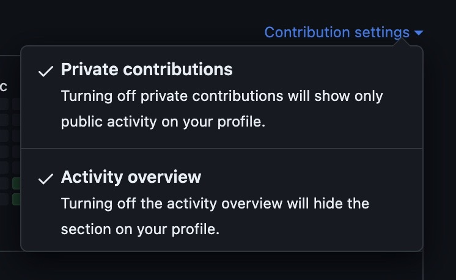

# GitHub Contribution Graph Painter + Snake 🐍

Create custom designs for your GitHub Commit Contribution Graph and show them off with a snake animation!

---

## 🎨 GitHub Contribution Graph Painter

**[Try the editor](https://githubgraphpainter.vercel.app/)**  


### Usage

1. Add your repo URL in the editor.  
2. Select the year you want to paint (best results if the year is free from commits).  
3. Paint your pattern using the canvas.  
4. Download the generated script.  
   - You may need to run:  
     ```sh
     chmod 701 github_painter.sh
     sudo ./github_painter.sh
     ```  
   - This will create the commits for your pattern.

### Troubleshooting

- To remove the art, delete the repository or follow [this Stack Overflow guide](https://stackoverflow.com/questions/448919/how-can-i-remove-a-commit-on-github).  
- If your art doesn't appear, enable "Private Contributions" on your GitHub profile:



### Notes

- Use at your own risk! Committing many times can affect your contribution graph.  
- Always check the outputted `github_painter.sh` script before running.

---

## 🐍 Snake Animation

This project includes a GitHub Actions workflow (`.github/workflows/snake.yml`) that generates a snake animation based on your contribution graph.

### How it works

- The workflow runs daily, on push to `main`, or manually.  
- It generates `dist/github-snake.svg` and `dist/github-snake-dark.svg`.  
- The snake animation **starts by “eating” the lightest boxes first** (lowest-intensity days) and moves toward darker ones.

### Add to your README

```html
<picture>
  <source media="(prefers-color-scheme: dark)" srcset="dist/github-snake-dark.svg" />
  <source media="(prefers-color-scheme: light)" srcset="dist/github-snake.svg" />
  
</picture>
